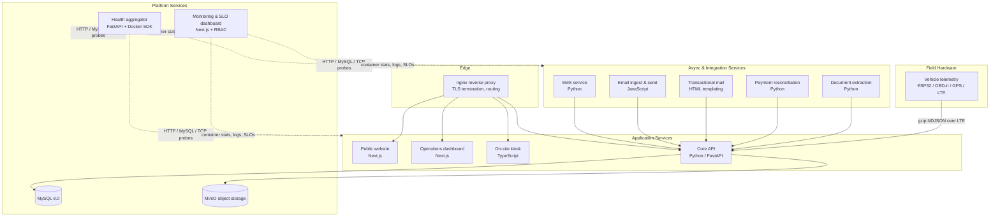

# Production Platform Architecture

**A solo-built, solo-operated microservices platform running a real business in production since 2023.**

This document describes the architecture of a production platform I designed, built, and operate end-to-end: 14 services plus embedded vehicle hardware, with CI/CD, observability, SLO tracking, and multi-environment deployment. The application code is proprietary (it runs my company); this repo documents the engineering.

---

## System Topology



## Service Inventory

| Service | Role | Stack |
|---|---|---|
| Core API | Business logic, single source of truth | Python, FastAPI, MySQL |
| Public website | Customer-facing site | Next.js |
| Operations dashboard | Internal operations app | Next.js |
| Kiosk | On-site self-service | TypeScript |
| SMS / Email / Mail | Customer messaging (inbound + outbound) | Python, Node |
| Payment reconciliation | Matches external payments to invoices | Python |
| Document extraction | Parses inbound documents into structured data | Python |
| Health aggregator | Fleet-wide health checks with auto-discovery | Python, FastAPI, Docker SDK |
| Monitoring dashboard | Container metrics, logs, alerting, SLO tracking | Next.js, RBAC |
| Vehicle telemetry | OBD-II + GPS collection from field vehicles | C++ / ESP32 / PlatformIO |
| nginx | Reverse proxy, TLS, routing | nginx:alpine |
| MySQL, MinIO | Persistence and object storage | Managed as containers |

## CI/CD

- Every service builds via **GitHub Actions → multi-arch images (amd64/arm64, Buildx + QEMU) → GHCR**.
- Semantic version tags (`v*.*.*`) cut releases; PRs build without publishing.
- Deployment is a single idempotent script: pulls repos, pre-builds Next.js apps, generates nginx config, and brings the stack up via Docker/Podman Compose.

## Multi-Environment Deployment

One deploy system serves multiple **fully isolated environments on the same host** — production, staging, and per-customer instances — each with its own env file, network, containers, and volumes:

```
./deploy.sh --env production
./deploy.sh --env staging
./deploy.sh --env customer-acme
```

The deploy system is published (genericized) at [compose-multienv-deploy](https://github.com/rahb3rt/compose-multienv-deploy).

**Multi-tenancy as a product.** The per-customer isolation model is evolving into a full control plane: customer signup, an admin dashboard, and customer self-service (site configuration, team management, backups) — turning the platform from a single-business system into multi-tenant SaaS, with each tenant getting an isolated stack (own database, object storage, domain routing, secrets, and hourly backups).

## Reliability Engineering

**Health aggregation.** A dedicated service auto-discovers containers via the Docker/Podman API and probes each over HTTP, MySQL, or TCP on a background loop — no manual registration, no stale check configs.

**Monitoring & SLOs.** A purpose-built dashboard tracks container metrics, aggregates logs, fires alerts, and tracks SLOs, behind database-backed RBAC.

**Backups.** Every tenant stack takes hourly backups of its database and object storage.

**Design-for-failure at the edge.** The vehicle telemetry firmware assumes connectivity is unreliable and data loss is unacceptable: NDJSON rows persist to SD with size/time-based file rotation, survive reboots, and upload as gzip-compressed batches over LTE with retry and backoff.

## Design Decisions

**Compose over Kubernetes.** I operate multi-tenant Kubernetes at day-job scale — which is exactly why this platform doesn't use it. On a single host, Kubernetes buys autoscaling, bin-packing, and rolling deploys this system doesn't need, and the price is a control plane to patch, upgrades to sequence, and a much larger failure surface to debug alone. Compose gives a one-file topology, deterministic deploys, and disaster recovery that amounts to "restore volumes, re-run the deploy script." The revisit trigger is explicit: a second host, or a genuine need for zero-downtime rollouts.

**Build vs. buy for monitoring.** Hosted observability is priced per-container and per-GB of ingest — for a single-host platform, that bill would rival the entire infrastructure budget. The actual requirements were narrow and Docker-native: container stats, log aggregation, alerting, and SLO tracking. Building a purpose-fit dashboard kept everything on one pane, kept data on-host, and let me implement SLO tracking the way I practice it professionally — explicit targets reviewed against reality, not dashboard-watching.

**Store-and-forward telemetry.** Field vehicles are the harshest environment in the system: LTE dead zones, uploads dying mid-flight, power cut at ignition-off. The firmware treats the SD card as the source of truth — every reading lands on disk as NDJSON before anything else, files rotate by size and time, and an uploader drains them as gzip-compressed batches with retry and backoff whenever connectivity allows. For telemetry, durability beats latency: a reading that arrives ten minutes late is fine; one that never arrives is not.

**Per-environment isolation on one host.** The deploy system runs production, staging, and dedicated customer instances side by side, each with its own env file, network, containers, and volumes. A staging environment shaped exactly like production — same compose file, same generated nginx config — catches configuration drift before customers do, and the same isolation makes standing up a dedicated customer instance a one-command operation instead of a re-architecture.

---

*The platform has been in continuous production operation since 2023. I'm happy to walk through any component in depth — including code — in an interview setting.*
