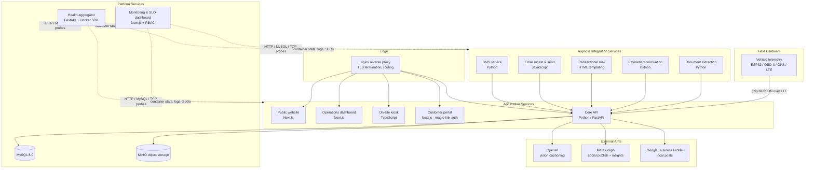

# Anatomy of a Solo-Operated Production Microservice Platform

**Robert Davis** — CEO, CTO, and Principal Architect — sole developer and operator of the system described.

**A solo-built, solo-operated microservices platform running a real business in production since 2023.** *Revised August 26, 2026.*

**▶ The primary, typeset version of this document — research-paper style, with figures — is served at [rahb3rt.github.io/platform-architecture](https://rahb3rt.github.io/platform-architecture/). This README is the plain-markdown mirror.**

This document describes the architecture of a production platform I designed, built, and operate end-to-end: 15 services plus embedded vehicle hardware, with CI/CD, observability, SLO tracking, and multi-environment deployment behind a self-service control plane. The application code is proprietary (it runs my company); this repo documents the engineering.

**By the numbers:** 15 services · 17,000+ jobs scheduled · 5,200+ invoices processed · 100,000+ vehicle telemetry readings · hourly per-tenant backups · 1 operator. Counts are `SELECT COUNT(*)` aggregates from the production database.

---

## System Topology


```mermaid
flowchart TB
    subgraph edge [Edge]
        NGINX[nginx reverse proxy<br/>TLS termination, routing]
    end

    subgraph apps [Application Services]
        WEB[Public website<br/>Next.js]
        APP[Operations dashboard<br/>Next.js]
        KIOSK[On-site kiosk<br/>TypeScript]
        PORTAL[Customer portal<br/>Next.js · magic-link auth]
        API[Core API<br/>Python / FastAPI]
    end

    subgraph workers [Async & Integration Services]
        SMS[SMS service<br/>Python]
        EMAIL[Email ingest & send<br/>JavaScript]
        MAIL[Transactional mail<br/>HTML templating]
        PAY[Payment reconciliation<br/>Python]
        EXTRACT[Document extraction<br/>Python]
    end

    subgraph platform [Platform Services]
        HEALTH[Health aggregator<br/>FastAPI + Docker SDK]
        MON[Monitoring & SLO dashboard<br/>Next.js + RBAC]
        MYSQL[(MySQL 8.0)]
        MINIO[(MinIO object storage)]
    end

    subgraph field [Field Hardware]
        TELEM[Vehicle telemetry<br/>ESP32 / OBD-II / GPS / LTE]
    end

    subgraph ext [External APIs]
        OPENAI[OpenAI<br/>vision captioning]
        META[Meta Graph<br/>social publish + insights]
        GBPX[Google Business Profile<br/>local posts]
    end

    NGINX --> WEB & APP & KIOSK & PORTAL & API
    API --> MYSQL & MINIO
    SMS & EMAIL & MAIL & PAY & EXTRACT --> API
    TELEM -->|gzip NDJSON over LTE| API
    API --> OPENAI & META & GBPX
    HEALTH -.->|HTTP / MySQL / TCP probes| apps & workers & platform
    MON -.->|container stats, logs, SLOs| apps & workers & platform
```

## Service Inventory

| Service | Role | Stack |
|---|---|---|
| Core API | Business logic — 60 route domains, 520 endpoints | Python, Flask, MySQL |
| Public website | Customer-facing site | Next.js |
| Operations dashboard | Internal operations app | Next.js |
| Kiosk | On-site self-service | TypeScript |
| Customer portal | Balance, invoices, next visit, service requests | Next.js 15, passwordless magic-link auth |
| SMS / Email / Mail | Customer messaging (inbound + outbound) | Python, Node |
| Payment reconciliation | Matches external payments to invoices | Python |
| Document extraction | Parses inbound documents into structured data | Python |
| Health aggregator | Fleet-wide health checks with auto-discovery | Python, FastAPI, Docker SDK |
| Monitoring dashboard | Container metrics, logs, alerting, SLO tracking | Next.js, RBAC |
| Vehicle telemetry | OBD-II + GPS collection from field vehicles | C++ / ESP32 / PlatformIO |
| nginx | Reverse proxy, TLS, routing | nginx:alpine |
| MySQL, MinIO | Persistence and object storage | Managed as containers |

## Core API Surface

The core API is a Flask monolith-by-choice: **60 route domains, 520 endpoints**, one deployable.

| Area | Capabilities |
|---|---|
| Billing | invoicing, payments, payment methods, statements, quotes, customer credit, expenses |
| Contracts | templates, e-signing, audit trail |
| CRM | customers, properties, leads, requests, sites |
| Workforce | employees, teams, geofenced timeclock (both punch directions), timecards with punch-linked integrity, time-off, payroll |
| Operations | jobs, scheduling, calendar, route optimization, mowing, plowing plans, service plans |
| Communications | messaging, notifications, marketing campaigns, AI social publishing (vision captioning, autopilot scheduling, multi-platform publish, engagement insights) |
| Field & assets | vehicle telemetry, assets, access devices, access events, weather |
| Platform | auth, RBAC roles, orgs, dashboards, reports, insights, webhook deliveries |

## AI-Assisted Publishing (closed loop)

The social subsystem is a small production case study in operating an LLM feature end-to-end:

- **Vision captioning with structured outputs.** Each photo is captioned by a vision call constrained to a JSON schema (title / caption / hashtags), with the caption contract — contact line placement, hashtag count and casing — enforced in code rather than trusted to the model.
- **Style rotation, measured.** Captions commit to one of a set of rotating engagement "angles"; every generated caption records which angle produced it. Publishing stores the resulting platform post ids, and an insights endpoint batch-fetches engagement from the Graph API and rolls it up **per angle** — so the prompt styles are judged by results, not vibes.
- **Prompts are data.** All prompts, style lists, and posting parameters live in a settings table (system defaults seeded and refreshed from code, owner overrides stored beside them). Tuning the voice never requires a deploy.
- **Server-enforced scheduling constraints.** One post per business-timezone calendar day, enforced at create/update and inside the autopilot allocator — conflicts slide forward and the API's response says why the date moved.
- **Rate-limit-aware caching.** Third-party feeds are layered: browser persistence paints instantly, a server-side TTL cache absorbs passive traffic, and an explicit refresh is the only real upstream fetch — with a floor so even button-mashing can't burn the API quota.
- **Failure surfacing.** Publish failures, OAuth tokens flipped to needs-reconnect *before* expiry, and new-comment deltas all flow into the app's notification stream via an event table — piggybacked on the publisher's existing cadence, costing no extra polling.
- **Media normalization at the door.** Phone uploads (HEIC/AVIF) are decoded — WASM for the patent-encumbered codec — and re-encoded to platform-safe JPEG at upload; serving goes through on-the-fly WebP thumbnails with immutable cache headers.

## CI/CD

- Every service builds via **GitHub Actions → multi-arch images (amd64/arm64, Buildx + QEMU) → GHCR**.
- Semantic version tags (`v*.*.*`) cut releases; PRs build without publishing.
- Deployment is one idempotent tool (`stackctl`): pulls service repos, pre-builds the Next.js apps, provisions per-environment infrastructure, regenerates edge routes, and brings the stack up under Docker or Podman — rebuilding only the services whose commit SHA actually moved.

## Multi-Environment Deployment

One deploy system serves **N fully isolated environments on the same host** — production, staging, and a dedicated stack per customer are all the same mechanism, just differently named:

```
stackctl deploy production
stackctl deploy staging
stackctl deploy acme
```

Each stack gets its own network, its own MySQL server, its own object storage, its own secrets, and its own domain routes — no data infrastructure is shared between environments. The only shared component is a single Caddy edge proxy that terminates TLS and routes by hostname; each stack attaches its own routes at deploy time. A staging environment shaped exactly like production catches configuration drift before customers do, and the same isolation makes standing up a dedicated customer instance a one-command operation instead of a re-architecture.

The system is two layers: `stackctl` deploys environments, and a control plane turns them into a product.

### stackctl — the deploy layer

```bash
stackctl new acme --domain acmelawns.com --company "Acme Lawns LLC"
stackctl deploy acme               # rebuilds only services whose repo SHA moved
stackctl deploy acme api --force   # force one service
stackctl rollback acme api         # per-stack rollback to the previous image
stackctl backup acme               # gzipped dump; newest 72 retained (~3 days hourly)
stackctl restore acme <file>       # destructive; typed confirmation required
stackctl destroy acme --yes
stackctl proxy up | reload | status
```

- **Naming is the isolation boundary.** Everything is prefixed by stack name — network `acme-net`, containers `acme-api` / `acme-app`, database `acme`, storage `acme-minio`.
- **Container DNS, not IPs.** Services address each other by name on the stack network (`http://acme-api:5002`). The previous generation substituted live container IPs into an nginx config, which forced sequential container swaps and a proxy redeploy on every change. Deploy order is now irrelevant.
- **Change detection by SHA.** A service redeploys only when its repo SHA differs from the stack's recorded deployed SHA; already-built SHAs deploy from cache.
- **Image sharing where it's safe.** Backend services build one image per git SHA and share it across every stack. Next.js frontends bake per-environment branding at build time, so those build per stack.
- **Feature flags per environment.** `ENABLE_SMS`, `ENABLE_KIOSK`, `ENABLE_WEB`, … — a disabled service is neither deployed nor routed.
- **Automatic TLS.** Caddy provisions and renews Let's Encrypt certificates for every routed domain, including each new subdomain on first deploy.
- **Idempotent schema bootstrap.** A fresh database is seeded from the API repo's checked-in schema and tracked by a marker table, so re-running provisioning is safe.

### Control plane — the tenant layer

A Node/Express service with a React SPA sits on top of `stackctl`. **It never reimplements deploy logic** — every state change shells out to `stackctl`, and status is read from the stackctl registry plus a single container-engine query. Anything done by hand on the CLI is reflected in the UI automatically, so the two can't drift.

- **Signup → workspace.** A customer claims a name and gets a full isolated stack at `<name>.<base-domain>`, on wildcard DNS with certificates issued on first deploy.
- **Admin dispatch board.** Every stack as a grid with one cell per service, live status, the tenant list, and a job queue with a streaming log drawer.
- **Provisioning is gated by default.** Auto-provision is off: an anonymous form that immediately consumes a full stack's worth of RAM and disk is a denial-of-wallet vector, so signups queue for approval unless they're gated upstream.
- **Serialized jobs.** Deploys are heavy and not concurrency-safe per stack, so the job runner executes exactly one at a time.
- **Tenant security.** Owner/member roles, expiring invitations, and a per-tenant audit log.
- **Billing and licensing.** Subscription plans with entitlements (Community through Enterprise), annual terms and add-ons, plus Ed25519-signed licenses verified and enforced at the stack level for self-hosted installs.

### Multi-tenant productization — Field Platform

As of August 2026 the platform is offered multi-tenant as **Field Platform** ([fieldplatform.io](https://fieldplatform.io)). The control plane runs containerized on the same host and drives the host container engine over its socket (Docker-outside-of-Docker, repo bind-mounted at an identical absolute path so host-path semantics hold), speaking the Docker-compat API because podman 3.4's libpod endpoint rejects newer remote clients. Each customer stack keeps full isolation — own bridge network, MySQL, MinIO, secrets, SHA-tagged images (backends shared, frontends per stack because `NEXT_PUBLIC` branding is baked at build time), with an optional registry pull-through (`IMAGE_REGISTRY`) for prebuilt backends. Provisioning is fully dynamic: Cloudflare-API DNS records tagged `stackctl:<name>` so destroy removes exactly what create wrote, and one Let's Encrypt certificate stretched over every stack's `<domain>` + `*.<domain>` via certbot DNS-01, hot-swapped in place (inode-preserving overwrite) and gracefully reloaded. Routing is two-tier during pre-cutover: legacy nginx terminates TLS and forwards a `*.fieldplatform.io` catch-all to a shared Caddy edge (:8880, plain-HTTP sites to avoid redirect loops), which routes by Host header to each stack's own Caddy proxy on a published host port, which routes by container DNS on the stack network — adding a customer touches no nginx config. A demo stack ([demo.fieldplatform.io](https://demo.fieldplatform.io)) exercises the whole path; the first tenant deploy surfaced and fixed three latent defects (stale seed schema, ancient node in non-interactive shells, `next build` auto-installing `@types/node`).

The earlier single-business deploy script is still in the tree, untouched, as the rollback path. Its genericized multi-environment form is published at [compose-multienv-deploy](https://github.com/rahb3rt/compose-multienv-deploy).

## Reliability Engineering

**Health aggregation.** A dedicated service auto-discovers containers via the Docker/Podman API and probes each over HTTP, MySQL, or TCP on a background loop — no manual registration, no stale check configs.

**Monitoring & SLOs.** A purpose-built dashboard tracks container metrics, aggregates logs, fires alerts, and tracks SLOs, behind database-backed RBAC.

**Backups.** The control-plane process drives hourly per-tenant backups: one gzipped dump of both of a stack's databases (business + monitoring), written with drop-and-create semantics so a restore fully reconstructs them, mode-600 because the file is the whole dataset, and pruned to the newest 72 (~3 days). Restores are explicitly destructive and require typed confirmation.

**Deploy preflight.** The deploy path verifies the core datastores (MySQL, object storage) are running before any service swap — starting them if stopped, aborting the deploy if they won't come up — because deploying against a down datastore bakes dead endpoints into every rebuilt container's environment.

**Design-for-failure at the edge.** The vehicle telemetry firmware assumes connectivity is unreliable and data loss is unacceptable: NDJSON rows persist to SD with size/time-based file rotation, survive reboots, and upload as gzip-compressed batches over LTE with retry and backoff.

## Failures, on the Record

**Postmortem — June 2026 — "The observer effect."** The monitoring dashboard gained a live topology view (container stats, sparklines, request traces) on top of its real-user-monitoring ingest. The monitoring database lives on the same MySQL server as production, and within hours the topology view was timing out — every timeout representing load pressure on the database that also serves the business.

The first fix made it worse: parallelizing all DB queries and trace fetches multiplied the concurrent load on an already-stressed database, and was reverted the same day. The durable fix went the opposite direction — batch the RUM inserts, reduce query limits, poll slower, fetch fewer traces, and put explicit timeouts and error containment on every query so the dashboard degrades instead of hammering.

**The lesson: monitoring is production.** The observer carries the same load budget as the observed, and parallelism is not a fix for overload — it is a multiplier on it.

```
jun 08  ff77443  Fix topology timeout: batch RUM inserts into chunks of 25
jun 08  730466e  Fix topology timeout: parallelize all DB queries and trace fetches
jun 08  d4ce6c3  Revert "Fix topology timeout: parallelize all DB queries and trace fetches"
jun 08  9036fc7  Fix topology timeout: reduce query limits safely
jun 08  b743295  Fix topology timeouts: slower polling, fewer trace fetches
jun 09  4aa70e5  Fix topology loading: reduce limits, add timeouts, catch errors
```

**Postmortem — August 2026 — "The build that lied."** An image-processing dependency shipped its native binaries as optional packages carrying a `node >= 20.9` engines constraint; the runtime image ran Node 18. npm skips engine-mismatched optional dependencies **silently** — so the image built green and the container came up healthy, but the first `require()` at request time threw, and every image the dashboard serves returned a 500 through the framework's generic error page.

Diagnosis came from the outside in: sibling routes sharing every import *except* the image library answered clean JSON errors, isolating the failing module without a shell on the box. The fix was one line (bump the runtime to Node 20); the finding was not: **a green build proves the dependency graph resolved, not that it can load.** Engines mismatches on optional dependencies are a silent runtime landmine — the class of failure that only surfaces in production, on the first request.

```
aug 25  8700923  Bump runtime image to node:20-alpine for sharp 0.35
```

## Security Posture

- **Isolation by default** — every tenant stack gets its own network, database, object storage, and secrets; there is no shared state to leak across.
- **Secrets out of band** — credentials live in per-environment env files injected at deploy time, never in images or git.
- **TLS at the edge** — each stack fronts through its own edge proxy with TLS termination; certificates auto-provisioned and renewed.
- **Passwordless customers** — portal sign-in is a 15-minute magic link over SMS; the request endpoint is enumeration-proof and rate-limited, sessions are stateless JWTs revocable by one secret rotation.
- **AuthN/AuthZ** — database-backed RBAC with role-to-permission mapping, session management, and a token blacklist for immediate revocation.

## Design Decisions

**Compose over Kubernetes.** I operate multi-tenant Kubernetes at day-job scale — which is exactly why this platform doesn't use it. On a single host, Kubernetes buys autoscaling, bin-packing, and rolling deploys this system doesn't need, and the price is a control plane to patch, upgrades to sequence, and a much larger failure surface to debug alone. Compose gives a one-file topology, deterministic deploys, and disaster recovery that amounts to "restore volumes, re-run the deploy script." The revisit trigger is explicit: a second host, or a genuine need for zero-downtime rollouts.

**Build vs. buy for monitoring.** Hosted observability is priced per-container and per-GB of ingest — for a single-host platform, that bill would rival the entire infrastructure budget. The actual requirements were narrow and Docker-native: container stats, log aggregation, alerting, and SLO tracking. Building a purpose-fit dashboard kept everything on one pane, kept data on-host, and let me implement SLO tracking the way I practice it professionally — explicit targets reviewed against reality, not dashboard-watching.

**Store-and-forward telemetry.** Field vehicles are the harshest environment in the system: LTE dead zones, uploads dying mid-flight, power cut at ignition-off. The firmware treats the SD card as the source of truth — every reading lands on disk as NDJSON before anything else, files rotate by size and time, and an uploader drains them as gzip-compressed batches with retry and backoff whenever connectivity allows. For telemetry, durability beats latency: a reading that arrives ten minutes late is fine; one that never arrives is not.

**Per-environment isolation on one host.** Production, staging, and dedicated customer instances run side by side, each with its own env file, network, containers, database, and volumes — one mechanism, differently named. The cost is honest: shared-nothing per environment means a full MySQL and object store per stack, which trades RAM and disk for a blast radius that stops at one environment — the right trade while stack count is small, and the thing to revisit before it isn't.

**Prompts as data, not code.** The AI publishing prompts, style rotations, and posting parameters live in the database with code-seeded defaults and owner overrides side by side. Prompt tuning is the highest-frequency change in the subsystem; making it a deploy would either freeze iteration or turn every voice tweak into a release. The trade is a settings table and a seeding pass at startup — cheap — against a feedback loop (angle-level engagement metrics) that can actually be acted on the same day.

**One source of truth for deploys.** The control plane could have talked to the container engine directly and been faster to build. Instead every state change shells out to the same `stackctl` I use by hand, and status is read back from its registry. A second implementation of "what does deployed mean" is a guarantee that the UI and the CLI will eventually disagree — usually during an incident, when the dashboard is the thing you're trusting. Shelling out costs a process spawn; disagreeing costs the outage.

---

*The platform has been in continuous production operation since 2023. I'm happy to walk through any component in depth — including code — in an interview setting.*
